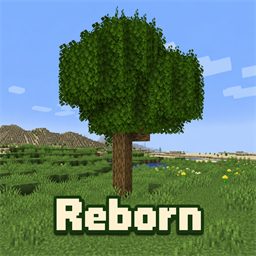

# Better Foliage Reborn

Version **1.0.0** — a client-side visual enhancement mod for Minecraft 1.21 / 1.21.1 on NeoForge.

This project is a fork of [Better Foliage Renewed](https://www.curseforge.com/minecraft/mc-mods/better-foliage-renewed). It retains features from Renewed while adding new effects, expanded compatibility, and selected features from the original [Better Foliage](https://www.curseforge.com/minecraft/mc-mods/better-foliage) that were not ported in the Renewed version this fork is based on.

Most elements of this mod can be disabled via Resource Packs.

## Restored and new features

- **Reeds in shallow water:** restores a classic Better Foliage effect. Reeds use crossed textures with coordinate-based variation in texture and horizontal position. They appear above recognized dirt under a full, still water block with air above, outside beach and ocean biomes. Density is configurable through `reed.population` (default: `0.5`). These are decorative geometry, not new blocks.
- **Snow-covered leaf fluff:** restores snowy tops for bushy leaves when snow lies above them. Snow overlays are composed with the active fluff textures and regenerated on resource reload, avoiding a separate hand-made snowy texture for every leaf type.
- **Floating cherry petals:** adds decorative petals on water beneath vanilla cherry leaves, with coordinate-based placement and randomized four-quadrant layouts. Petals use flower textures without stems, are visible from above and below, and do not add actual blocks. The search is limited to ten blocks below the leaves; intervening non-air, non-water blocks stop it, and water immediately below the leaves is excluded.
- **Shader animation:** adds Iris integration for reeds and floating petals. Reeds can use the shader pack's vegetation waving; floating petals have motion support without being classified as water. The final appearance depends on the shader pack.
- **Stable fluff variation:** leaf positions and rotations vary deterministically by block coordinates, including height, reducing coincident surfaces and flickering while retaining a natural, irregular appearance.

## Rendering and resource-pack compatibility

- **Ecliptic Seasons:** renders snowy fluff when the mod considers the leaf block snow-covered, as well as when ordinary snow lies above the leaves. The integration uses a compile-only dependency; Ecliptic Seasons is not bundled or required at runtime.
- **Sodium Leaf Culling:** respects its None, Hollow, Solid, and Solid Aggressive modes. Hidden fluff is omitted according to the selected mode, avoiding opaque fluff squares caused by leaf-culling optimizations.
- **Cull Leaves (4.1.1):** keeps its original leaf-cube face culling, but renders BF fluff as a complete, independently culled cross. While Cull Leaves culling is enabled, fluff is hidden only when all six adjacent positions contain non-air blocks (including water and non-solid blocks). Snowy fluff and supported resource-pack bushy models follow the same rule. No Cull Leaves runtime dependency is required. If Sodium Leaf Culling is also enabled, its existing suppression rules still apply independently.
- **Sodium / Iris:** includes optional rendering bridges for the additional vegetation geometry and shader material handling. Shader waving still requires a shader pack that supports the relevant vegetation category.
- **Stay True and supported bushy-leaf resource-pack models:** reuses the pack's bushy textures while letting Better Foliage control fluff placement, rotation, and leaf-culling compatibility. This is not a guarantee of support for every custom model format.
- **Resource reloads:** generated snowy fluff follows the currently loaded textures; reloading resources reuses validated disk caches or rebuilds changed variants.
- **Oh The Biomes We've Gone:** white and yellow sakura leaves also support floating petals in their corresponding colors.

These integrations are optional. The mod can run without the corresponding mods or resource packs installed.

## Expanded built-in leaf compatibility

Compared with the Renewed base used by this fork, additional fluff models and textures are bundled for the following mods:

| Mod | Added coverage |
| --- | --- |
| Oh The Biomes We've Gone (BWG) | A broad selection of leaves, including flowering and fruit-bearing variants, colored leaves, and white/yellow sakura |
| Biomes O' Plenty (BOP) | Supplements existing compatibility with orange, red, and yellow maple, cypress, and snowblossom leaves |
| Upgrade Aquatic | River leaves, with biome tinting |
| BetterEnd | Dragon tree, lacugrove, pythadendron, and cave-bush variants |
| Cluttered | Crabapple, fluorescent maple, poplar, sycamore, willow, and flowering variants |
| Cook's Collection | Lemon leaves |
| Cultural Delights | Avocado and fruiting avocado variants |
| Eternal Starlight | Banyin, cradlewood, lunar variants, northland, scarlet, and torreya leaves |
| Paster Dream (`pasterdream`) | Cold domain, dyedream, dyedream worldtree, and windmoor variants |

Existing compatibility resources are also retained for Atmospheric, Bayou Blues, Biomes O' Plenty, Enhanced Farming, Quark, and TerraFirmaCraft. Bundled resources cover specific supported blocks; they do not imply complete coverage of every version of each mod.

All these compatibility assets are included directly in the mod JAR. No separate Better Foliage Addons resource pack is needed. Supplemental models use isolated `betterfoliage_*` namespaces to preserve the existing compatibility resources.

## Configuration

### Single-layer snowy fluff

Untinted fluff receives three automatically composited snow textures during block-atlas loading. Tinted fluff receives a finite palette of precolored composites: only the leaves are colored, then the original snow pixels are applied. Snowy blocks reuse their ordinary fluff geometry with the selected composite UVs and no second tint pass, instead of drawing a second snow layer. Normal fluff geometry, coordinate-based variation and culling rules are unchanged.

Tinting is determined from model data, not whether the image looks gray: BF uses `tintLeaves`; supported resource-pack bushy faces use their actual tint indices. This includes Stay True's tinted oak-style bushy models and untinted birch-style models. Vanilla model inheritance, texture aliases and base animation frames are preserved.

The palette samples the **active** foliage/leaves colormaps in `textures/colormap` (including mod namespaces), adds white and vanilla fixed species colors, and optionally accepts extra RGB colors. During mesh construction the real block color callback (tint index 0) selects a close palette entry using a precomputed lookup. Unrepresented seasonal/mod colors always use a nearby palette color, regardless of color difference; they do not trigger layered rendering. No image processing, disk access, world-wide scanning or per-position image cache is needed during rendering. The original two-layer effect remains the fallback for unavailable tint data, unsupported tint indices, missing/custom assets, independently animated snow overlays and over-budget textures. Arbitrary mod color callbacks cannot be exhaustively enumerated in advance.

Client configuration section `[snowPalette]` (reload resources after changing):

| Setting | Default | Meaning |
| --- | --- | --- |
| `enabled` | `true` | Enable finite-palette single-layer rendering for tinted fluff |
| `colorStep` | `8` | RGB sampling interval; smaller values generate a finer, larger palette |
| `maxColors` | `1024` | Maximum palette entries, including fixed colors |
| `atlasBudgetMiB` | `128` | Budget for added image pixels including estimated mipmaps; atlas packing overhead is additional |
| `eclipticLeaves` | `true` | Merge supported Ecliptic Seasons leaf-cube snow faces as well as BF fluff |
| `eclipticAtlasBudgetMiB` | `64` | Separate added-image budget for ES leaf-cube composites; estimated mipmaps included |
| `diskBudgetMiB` | `512` | Total compressed cache budget; oldest BF bundles are evicted after reload |
| `extraColors` | `""` | Optional exact RGB colors, e.g. `"FF8800,AA3377"`, for known seasonal/mod tints |

The default sampling interval has at most 4/255 rounding error per sampled channel, but actual palette selection has no color-error cutoff (the former `maxChannelError` setting was removed). Colors far outside the palette can visibly differ; `extraColors` can improve their representation. This is an approximation of each block's tint, not an exact reproduction of every renderer's per-vertex biome blending. A smaller interval increases texture count and may make more textures hit the atlas budget and use the layered fallback. Untinted composites get budget priority, and additional atlas-size headroom is reserved.

### Persistent snow texture cache

Generated pixels are stored in `<game directory>/.cache/better-foliage/`. Each source fluff texture has one hashed `.bfs` file containing **all generated palette colors and three snow variants**, not hundreds of separate PNGs. The format is a versioned GZIP-compressed binary pixel bundle, indexed by palette entry and snow variant; current animation metadata is reapplied when loading it. Its contents are lossless even though palette selection is approximate.

Source pixel data, frame dimensions, palette colors and format version are fingerprinted. On reload, unchanged bundles are reused; changed resources or corrupt/truncated caches are rebuilt and atomically replaced. Read/write failures do not disable snowy fluff. Unused older bundles may remain until budget eviction. It is safe to remove this generated cache while the game is closed; the next load recreates it. No resource-pack files are modified.

Disk compression saves storage and repeated composition work, **not VRAM**: validated textures still have to be decoded, stitched and uploaded to the block atlas. The atlas owns the in-memory sprites and releases/replaces them with the normal resource lifecycle.

### Ecliptic Seasons leaf-cube snow merging

The optional bridge targets the Ecliptic Seasons **0.15.0-rc-3** rendering API. In addition to BF's own snowy fluff, it precomposes ES' standard `snow_overlay_leaves`, `snow_overlay_leaves_top` and `snow_spot_overlay_leaves` masks with the active leaf-cube textures. Untinted textures get plain composites; tint-index-0 textures get the same finite-palette treatment as fluff, always approximating nearby colors rather than falling back because of color error. A fully opaque `minecraft:block/snow` face reuses the existing snow sprite directly, without generating redundant colored copies.

Only textures reachable from **registered leaf blockstates** are considered (including weighted variants and inherited resource-pack models). Leaf-cube bundles live in the same `.cache/better-foliage` directory, with separate keys from fluff bundles and the same content validation, atomic replacement and shared disk quota. The separate 64 MiB image budget avoids consuming fluff's budget; overall atlas-size headroom is still checked.

The bridge hooks ES' shared `cancelTop` path used by vanilla and Sodium. It preserves ES' snow decisions, selected snow model and neighbor snow-face culling. It replaces an eligible original cube face with its composite and only then suppresses the matching ES overlay face. Per-render context bookkeeping is reset between blocks, and the additional tint lookup is cached for the current block only. No per-frame image processing or position-to-texture cache is added.

Merging is deliberately limited to standard ES leaf overlays (leaf type 4), one full cube face per direction, untinted/index-0 faces, white vertex colors, and matching full-face UV layouts. Fruit/multi-layer faces, custom/cropped/rotated UVs, non-cube geometry, custom ES replacement models, unsupported masks or tint indices, and missing/over-budget composites retain ES' original rendering. This does not remove the separate extra snow-thickness effect, change snow coverage, replace BF fluff geometry or override leaf-culling mods. ES remains compile-only and is not required at runtime. These safeguards mean not every snowy leaf face necessarily becomes single-layer.

Many inherited visual features can still be customized through resource packs. Client configuration controls additional effects such as reed density. Compatibility models using the `betterfoliage:grass` loader can opt custom dirt blocks into reed rendering with `"renderReed": true`.

Install this fork in place of Better Foliage Renewed, not alongside it: both use the `betterfoliage` mod ID.

## Credits and license

Some assets contained in this repository are based on those from other mods for the purpose of providing compatibility. These assets follow the licenses of their respective mod authors. If you are an author who does not want derivatives of their assets hosted here, make an issue.

Original Better Foliage by **Octarine Noise**. Better Foliage Renewed by **EERussianguy**, co-authored by **Paint_Ninja**. This fork builds on their work.

This mod is under the MIT License.
